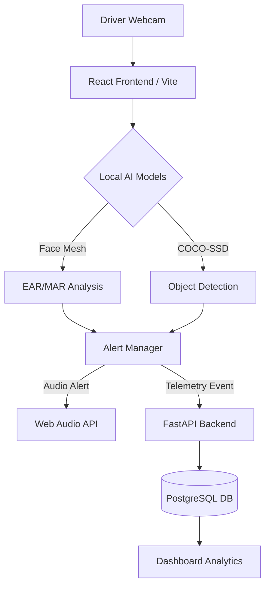

# RevoDrive (Smart Driver Monitoring & Telemetry)


RevoDrive is an advanced **Edge-Computing** driver monitoring system that detects drowsiness, distractions, and phone usage in real-time. By leveraging client-side GPU acceleration, it ensures zero-latency alerts and maximum driver privacy.

---

## 👁️ Core AI Capabilities

- **Drowsiness Detection (EAR)**: Uses the Eye Aspect Ratio formula over 468 3D facial landmarks to identify micro-sleep.
- **Fatigue Monitoring (MAR)**: Calculates the Mouth Aspect Ratio to track yawning frequency and fatigue levels.
- **Distraction Tracking**: Geometric gaze estimation (Yaw & Pitch) to detect when a driver looks away from the road.
- **Object Detection (COCO-SSD)**: Real-time identification of cell phones and other distracting objects using TensorFlow.js.
- **Intelligent Voice Alerts**: Multilayered audio feedback using the Web Speech and Web Audio APIs.

---

## 🏗️ Architecture Overview

The system follows a modern **Decentralized AI** architecture:



---

## 👥 Engineering Team & Domain Leads

| Name | Role | Core Contributions |
| :--- | :--- | :--- |
| **Harsh** | Backend Lead | FastAPI Architecture, SQLAlchemy ORM, Database Schema & API Security. |
| **Jivit** | Frontend Lead | "Vivid Dark" UI, Master Alert Loop, Framer Motion Animations & Voice Logic. |
| **Mallika** | Vision Scientist | EAR/MAR Mathematical Models, Scipy Integration & FaceMesh Mesh Logic. |
| **Divyanshu** | ML Developer | TensorFlow.js Deployment, Bounding Box Canvas Math & Mirror-Mode Logic. |
| **Hemant** | DevOps Lead | Docker Orchestration, Render/Railway Deployment & CI/CD Automation scripts. |

---

## 🛠️ Tech Stack & Dependencies

- **Frontend**: React 18, Vite, TypeScript, Tailwind CSS, Framer Motion.
- **AI Models**: MediaPipe FaceMesh, TensorFlow.js (COCO-SSD).
- **Backend**: FastAPI (Python 3.10+), Uvicorn.
- **Database**: PostgreSQL (Production), SQLite (Development).
- **Infrastructure**: Docker, Docker Compose, Vercel (UI), Render (API).

---

## 🚀 Quick Setup

### 1. Backend Setup
```bash
# Install dependencies
pip install -r requirements.txt

# Initial database setup (Hemant's Script)
python scripts/setup_database.py

# Start server
uvicorn main:app --reload
```

### 2. Frontend Setup
```bash
cd frontend
npm install
npm run dev
```

---

## 📍 Viva Reference Material
- **Edge AI Benefits**: Privacy (video never leaves device), Latency (real-time alerts), Cost (zero server GPU costs).
- **Relational Integrity**: Telemetry is linked to sessions via Foreign Keys in PostgreSQL.
- **Schema Validation**: Pydantic ensures only clean telemetry enters the data warehouse.

---
*Created for the Fourth Semester Engineering Project - © 2026 RevoDrive Team.*
